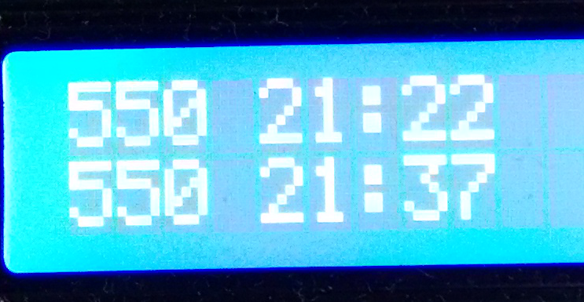
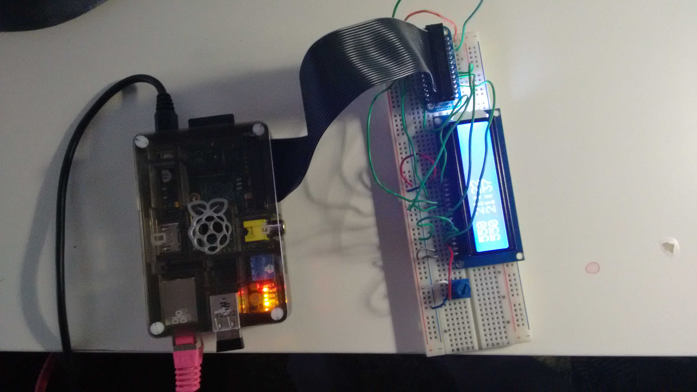

# Bus stop display with Raspberry Pi

A simple project to connect a small LCD display to a Raspberry Pi and
use Python to request bus departure information from the Helsinki Region Transport open API.

The project was built using a Raspberry Pi Model B and Python 2.7. 

For the LCD driver code I am using the LCD library from Adafruit, https://github.com/adafruit/Adafruit-Raspberry-Pi-Python-Code/blob/master/Adafruit_CharLCD/Adafruit_CharLCD.py , with one small change to make it work on a Raspberry Pi Model B. The line def init(self, pin_rs=25, pin_e=24, pins_db=[23, 17, 21, 22], GPIO = None): in Adafruit_CharLCD.py should be changed to def __init__(self, pin_rs=25, pin_e=24, pins_db=[23, 17, 27, 22], GPIO = None): 

## Instructions

To connect the LCD to the Pi, follow the instructions at https://learn.adafruit.com/drive-a-16x2-lcd-directly-with-a-raspberry-pi/overview.You’ll need a cobbler, a breadboard, some wire, a LCD display and a 5 V potentiometer, and you’ll also need to do some simple soldering.

Register at http://developer.reittiopas.fi/pages/en/account-request.php to get your account to the Helsinki Region Transport API. The username and passphrase go to the settings_file.py. A new version of the API has been released since this code was written, now you could also use a userhash instead of username and passphrase. This would only require a small change to the BusDisplay.stop_information method.

If you have connected the display, tested it as described in the tutorial, and edited the settings_file.py, you can run the code with 
sudo python lcd_bus_stop_display.py

## Configure display to show different stops

Each bus stop in the Helsinki region has its own short code consisting of letters and numbers (or, in Helsinki, of numbers only), and a longer unique id. The short codes can be found on the HSL website http://aikataulut.reittiopas.fi/pysakit/en/ and on the bus stop signs. The long codes are printed in a small font 

To change what stop information is shown, simply change the “code” parameter with which stop_information is called in lcd_busdisplay.py to something else. In the code I am using the long unique code for a stop, but the shorter codes, “E1218” for example, would also work, or even addresses.

When changing the stop information, It can be a good idea to test the new url first by trying  

http://api.reittiopas.fi/hsl/prod/?user=USERNAME&pass=PASSPHRASE&request=stop&code=CODE

in a browser to see what it returns.

## Notes

The code should also work with a Raspberry Pi Model A, if you just use https://github.com/adafruit/Adafruit-Raspberry-Pi-Python-Code/blob/master/Adafruit_CharLCD/Adafruit_CharLCD.py with no modifications. I have not tried this, however.
